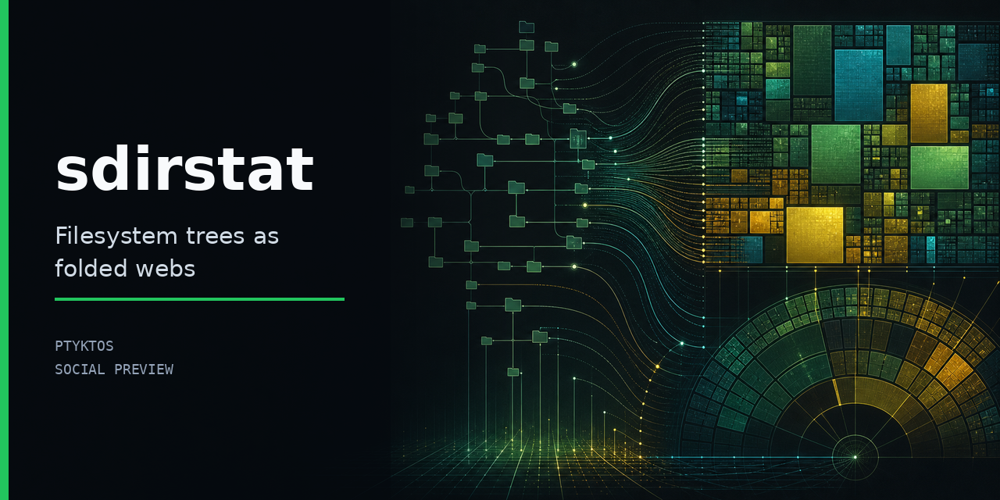

# sdirstat

**A fast, parallel disk-usage analyzer with an interactive treemap & sunburst GUI — and a
zero-dependency [QDirStat](https://github.com/shundhammer/qdirstat) cache writer.** Find what's
eating your disk, in the terminal or in a window.

[](https://scorecard.dev/viewer/?uri=github.com/Ptyktos/sdirstat)
[](#license)



Point it at a folder (or your whole disk) and it scans in parallel, then shows you where the space
went — as an explorable **treemap**, a **sunburst**, file-type statistics, and a sortable tree-table.
It can also emit a QDirStat cache file, a JSON tree, or a self-contained HTML report you can share.
The scanner is **byte-exact with `du`** and has **zero runtime dependencies**.

## Install

**Prebuilt binaries** (no toolchain needed) — grab one from the
[latest release](https://github.com/Ptyktos/sdirstat/releases/latest):

| platform | file |
|---|---|
| Linux x86-64 | `sdirstat-…-linux-x86_64` (glibc) or `…-musl` (static, runs on any distro) |
| Windows | `sdirstat-…-windows-x86_64.exe`, or the `.msi` installer |
| macOS (Intel + Apple Silicon) | `sdirstat-…-macos-universal` |

**Package managers:**

```sh
# Rust / any OS
cargo install sdirstat

# Arch Linux (AUR) — build from source, or -bin for the prebuilt binary
yay -S sdirstat            # or: paru -S sdirstat-bin

# Debian / Ubuntu (apt repo)
curl -fsSL https://ptyktos.github.io/sdirstat/apt/sdirstat.gpg.key \
  | sudo gpg --dearmor -o /usr/share/keyrings/sdirstat.gpg
echo 'deb [signed-by=/usr/share/keyrings/sdirstat.gpg] https://ptyktos.github.io/sdirstat/apt stable main' \
  | sudo tee /etc/apt/sources.list.d/sdirstat.list
sudo apt update && sudo apt install sdirstat

# Windows
winget install Ptyktos.sdirstat        # or: choco install sdirstat
```

**From source:** `git clone https://github.com/Ptyktos/sdirstat && cd sdirstat && cargo build --release`
(the binary lands at `target/release/sdirstat`).

## Usage

```sh
sdirstat ~/Downloads                   # scan a folder → a shareable report.html (treemap)
sdirstat /                             # scan the whole disk
sdirstat /home --total                 # just the grand total, fast
sdirstat serve                         # live web GUI at http://127.0.0.1:8080
sdirstat gui                           # the GUI as a standalone desktop window
sdirstat install-desktop               # add a clickable "sdirstat" entry to your app menu (Linux)
sdirstat /var --cache -o var.cache     # a QDirStat-openable cache file
sdirstat /srv --json | jq '…'         # a JSON tree for your own tooling
```

In the GUI you can drill into folders, switch between **treemap / sunburst / file-type** views, sort
by size, and right-click a file to **Open / Reveal / Copy path / Move to Trash**. There's also a fully
**native desktop app** (Tauri) — see [`desktop/`](desktop/).

## Features

- **Zero runtime dependencies** — the scanner is `std`-only; the GUI is vanilla JS, no CDN, works offline.
- **Byte-exact with `du`** — allocated sizes via `st_blocks × 512`, hardlink dedup, or `--apparent` for logical size.
- **Fast** — a parallel walk; `/usr` (1.25M entries) in ~0.5 s (≈14× the Perl `qdirstat-cache-writer` it replaces).
- **Four outputs from one scan** — interactive HTML, QDirStat cache (drop-in), JSON tree, or a plain total.
- **Interactive GUI** — squarified treemap, sunburst, file-type stats, breadcrumb navigation, file actions.
- **Safe by design** — the GUI binds `127.0.0.1` only; "Move to Trash" is reversible (no hard-delete). See [SECURITY.md](SECURITY.md).
- **Big-tree friendly** — OOM-guarded (`--max-entries`), optional `io_uring` backend for cold/SSD scans.

## How it works

Most tools are *either* an interactive GUI (Baobab, QDirStat, Filelight) *or* a headless script that
prints numbers. sdirstat is both, from one scan and no adapter. Internally the directory tree is a
**graph (a "Web")**: each node carries its own size, edges are dir → children, and a single
reverse-pass fold (`subtree = own + Σ children`) computes every output from the same structure. That's
why the GUI view, the cache file, the JSON, and the CLI total all come out of a single parallel walk.
The QDirStat cache output means it slots into existing workflows without replacing the visualiser.

## Releases & verification

Every release artifact is checksummed (`SHA256SUMS`), ships an SPDX SBOM, is signed with
[cosign](https://docs.sigstore.dev) (keyless), and carries [SLSA build provenance](https://slsa.dev).
See [RELEASE.md](RELEASE.md) and [docs/SIGNING.md](docs/SIGNING.md) to verify a download, and
[docs/PUBLISHING.md](docs/PUBLISHING.md) for how the package-manager channels are built.

## Contributing & license

Issues and PRs welcome — see [CONTRIBUTING.md](CONTRIBUTING.md). Dual-licensed under either
[MIT](LICENSE-MIT) or [Apache-2.0](LICENSE-APACHE), at your option.
